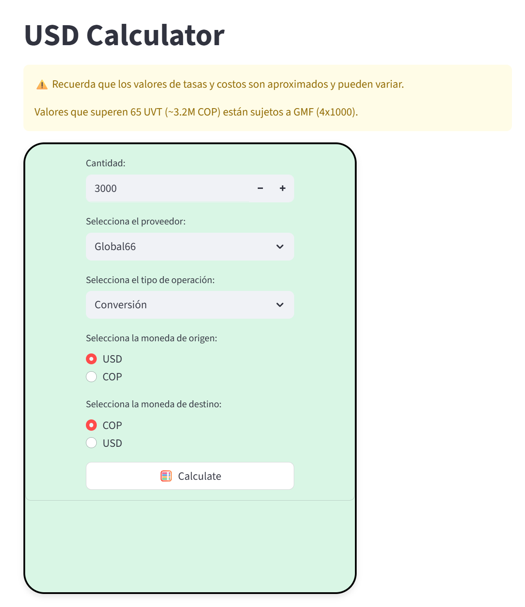

# USD Calculator

This is a simple USD calculator that allows you validate multiple providers for USD conversion rates. Global66, Ontop, Remitly, etc.

Deployed with Streamlit here: [USD Calculator](https://usdcalculatortool-codebydant.streamlit.app/)

## Dependencies

```bash
pip install -r requirements.txt
```

## How to run

```bash
streamlit run main.py
```

## Calculator

UI interface to input amount and select providers for conversion rates comparison.


